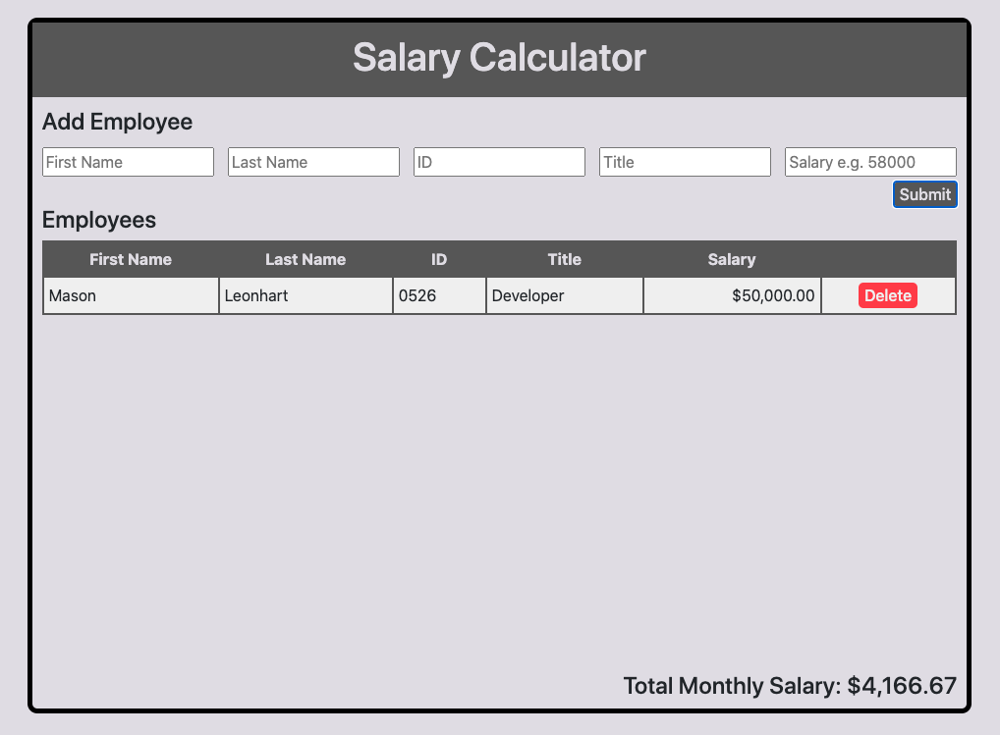

# jQuery Salary Calculator

## Application Description

_Duration: Weekend Assignment_

Here is an app that accepts a form of data, an employee's first name, last name, employee ID,
job title, and annual salary. On click of the submit button, the application will take all
data provided and formats it nicely into the table. The application will also take the
salaries of every employee in the table, add them together, and calculate an average monthly
salary that would have to be paid. If the average monthly salary is over $20,000.00, the 
application will let you know by highlighting the total monthly salary field in red.

## Application Preview

## Application Prerequisites

1. jQuery
2. Bootstrap

## Usage

1. Run application
2. Populate input fields with data
3. Click submit button and the application will do the rest
4. Click delete button on row that you would like to delete

## Built With

1. jQuery
2. Bootstrap